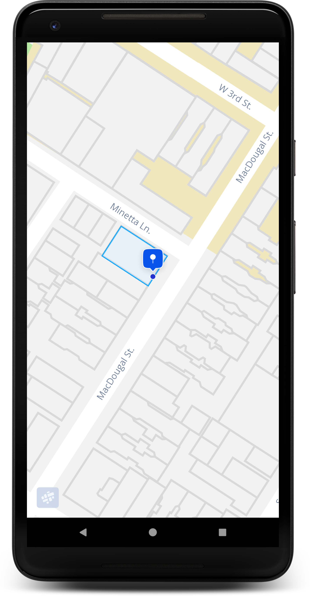

## Markers

#Add a Marker with coordinates
After instantiating your [MapView](https://mapfit-android.readme.io/v1.0.0/reference#mapview), you can add a [Marker](https://mapfit-android.readme.io/v1.0.0/reference#marker-1) as below. See [MarkerOptions](ref:markeroptions-1).

```kotlin
mapView.getMapAsync(onMapReadyCallback = object : OnMapReadyCallback {
    override fun onMapReady(mapfitMap: MapfitMap) {
    
        val position = LatLng(40.729913, -74.000664)
        mapfitMap.addMarker(
            MarkerOptions()
              .position(position)
              .icon(MapfitMarker.ARTS))
                
    }
})
```

#Add a marker with a street address
Alternatively, you can add a [MapView](https://mapfit-android.readme.io/v1.0.0/reference#mapview) to the map with a street address. This call uses Mapfit Geocoder API. 

```kotlin
val markerOptions = MarkerOptions()
            .streetAddress("111 Macdougal Street, New York, NY", true)
            .addBuildingPolygon(true)
            .icon(MapfitMarker.ARTS)

val marker = mapfitMap.addMarker(markerOptions)

// if the marker is being geocoded, add OnMarkerAddedCallback which will be 
// invoked when marker is visible on the map.
mapfitMap.addMarker(
            markerOptions,
                object : OnMarkerAddedCallback {
                    override fun onMarkerAdded(marker: Marker) {
										 
                    }

                    override fun onError(exception: Exception) {

                    }
                }
            )
```


#Choose a category marker
We have a wide selection of category icons to choose from for your [Marker](ref:marker-1). You can choose from any of the following markers from [MapfitMarker](ref:mapfitmarker-1).
You must specify which icon you'd like to use as below.


```kotlin
marker.setIcon(MapfitMarker.CAFE)
```
#Adding a custom marker
If you'd like to use your own icon, you may do so by using the following methods. 
```kotlin
// with a drawable resource
marker.setIcon(R.drawable.ic_custom_marker)

// with a drawable object
val drawable: Drawable = getCustomDrawable()
marker.setIcon(drawable)

// with a url that directs to your custom image
marker.setIcon("YOUR_MARKER_ICON_URL")

// with a bitmap object
marker.setIcon(bitmap)
```
# Marker click listener
Set your [OnMarkerClickListener](ref:onmarkerclicklistener-1) to listen [Marker](ref:marker-1) click events on the map.

```kotlin
 mapfitMap.setOnMarkerClickListener(object:OnMarkerClickListener{
            override fun onMarkerClicked(marker: Marker) {
                
            }
        })
```