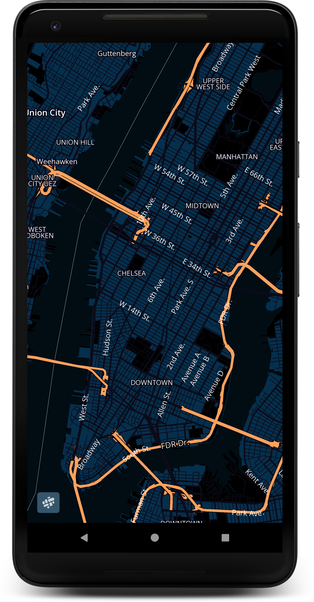
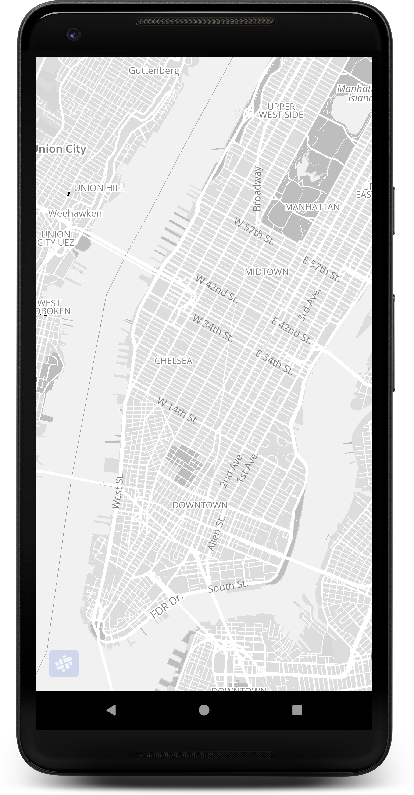

#Setting a map theme

# Theme options

We currently have 3 [MapTheme](ref:maptheme) available for use.

### Day Theme

```kotlin
mapfitMap.getMapOptions().theme = MapTheme.MAPFIT_DAY 
```

### Night Theme

```kotlin
mapfitMap.getMapOptions().theme = MapTheme.MAPFIT_NIGHT
```


### Grayscale Theme

```kotlin
mapfitMap.getMapOptions().theme = MapTheme.MAPFIT_GRAYSCALE
```


###Initializing MapView With A Default Theme
You also can initialize the [MapView](ref:mapview) with default themes.
```kotlin
 mapView.getMapAsync(
            mapTheme = MapTheme.MAPFIT_GRAYSCALE,
            onMapReadyCallback = object : OnMapReadyCallback {
                override fun onMapReady(mapfitMap: MapfitMap) {
                    // mapfitMap is ready to be used!
                }
            })
```
## Custom Theme
You can set your own theme with your YAML file as below.
```kotlin
// if the file is in assets folder
mapfitMap.getMapOptions().customTheme = "sample.yaml"

// if the file is in another folder
mapfitMap.getMapOptions().customTheme = "file://data/.../sample.yaml"

// if the file is hosted in web
mapfitMap.getMapOptions().customTheme = "https://mywebsite.com/sample.yaml"
```
###Initializing MapView With A Custom Theme
You can also initialize [MapView](ref:mapview) with a URL or file path of your YAML file.

```kotlin
mapView.getMapAsync(
            "YOUR_YAML_FILE_URL_OR_PATH",
            onMapReadyCallback = object : OnMapReadyCallback {
                override fun onMapReady(mapfitMap: MapfitMap) {
                   // mapfitMap is ready to be used!
                }
            })
```